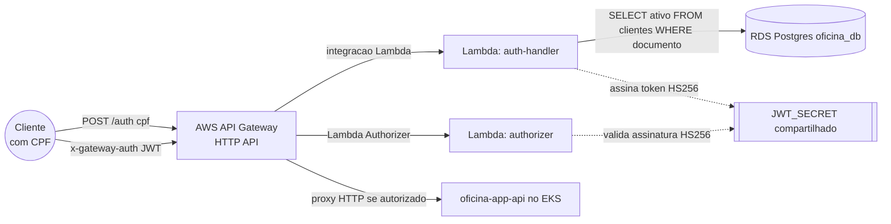

# oficina-auth-gateway

Gateway de autenticação por CPF para o ecossistema Oficina. Expõe um **AWS API Gateway** que:

- recebe o CPF do cliente, valida contra a base de clientes e devolve um **JWT**;
- protege outras rotas exigindo esse JWT, através de um **Lambda Authorizer**, antes de encaminhar a requisição para a [`oficina-app-api`](https://github.com/GrupoPosTech-FIAP/oficina-app-api) rodando no EKS.

Não é necessária nenhuma alteração na `oficina-app-api` — toda a validação acontece na borda (API Gateway).

## Arquitetura



- **`auth-handler`**: valida o formato do CPF, consulta a tabela `clientes` (mesmo RDS Postgres usado pela `oficina-app-api`) e, se o cliente existir e estiver ativo, assina um JWT.
- **`authorizer`**: Lambda Authorizer (REQUEST, simple response) que valida a assinatura/expiração do JWT recebido no header customizado `x-gateway-auth` (aceitando tanto o token puro quanto `Bearer <token>`) antes de liberar o proxy até a `oficina-app-api`.
- A rede (VPC, sub-redes) e o Security Group do RDS são reaproveitados dos repositórios [`oficina-infra-cluster`](https://github.com/GrupoPosTech-FIAP/oficina-infra-cluster) e [`oficina-infra-database`](https://github.com/GrupoPosTech-FIAP/oficina-infra-database) via Terraform remote state — nada de infraestrutura duplicada.

## Tecnologias

- **Node.js 20 + TypeScript** — código das duas funções Lambda.
- **AWS Lambda** — `auth-handler` (na VPC, acessa o RDS) e `authorizer` (fora da VPC).
- **AWS API Gateway (HTTP API)** — roteamento público + Lambda Authorizer.
- **Terraform** — toda a infraestrutura acima, usando a role `LabRole` do AWS Academy Learner Lab e remote state em S3 compartilhado com os demais repositórios do grupo.
- **Jest** — testes unitários (CPF, JWT, handlers), rodando sem dependência de AWS ou banco real.

## Contrato da API

### `POST /auth` (pública)

```json
// Request
{ "cpf": "529.982.247-25" }
```

| Situação | Status | Corpo |
|---|---|---|
| CPF mal formado | `400` | `{ "message": "CPF inválido" }` |
| CPF não cadastrado | `404` | `{ "message": "Cliente não encontrado" }` |
| Cliente inativo | `403` | `{ "message": "Cliente inativo" }` |
| Cliente ativo | `200` | `{ "token": "<jwt>" }` |
| Muitas tentativas do mesmo IP | `429` | `{ "message": "Muitas tentativas de autenticação. Tente novamente mais tarde." }` |

### Rotas protegidas — `ANY /app/{proxy+}`

Repassa a requisição para a `oficina-app-api`, exigindo o cabeçalho `x-gateway-auth: <token>` válido (emitido por `POST /auth`). O authorizer aceita tanto o token puro (`x-gateway-auth: <jwt>`) quanto com prefixo (`x-gateway-auth: Bearer <jwt>`). Nada chega na aplicação sem token válido:

| Situação | Status | Origem |
|---|---|---|
| Header `x-gateway-auth` ausente | `401` | API Gateway, antes de invocar o authorizer |
| Token inválido ou expirado | `403` | authorizer nega (`{"message":"Forbidden"}`) |
| Token válido | repassa | integração HTTP para a `oficina-app-api` |

### Isolamento de cabeçalho: por que usamos `x-gateway-auth` em vez de `Authorization`?

O API Gateway HTTP API v2 repassa os cabeçalhos recebidos para a aplicação de backend (`oficina-app-api`). Se usássemos o cabeçalho padrão `Authorization` na borda, a `oficina-app-api` tentaria validar o token com seu próprio filtro interno (`JwtAuthenticationFilter`), onde o CPF do cliente em `sub` dispararia falha no `loadUserByUsername` resultando em `403 Forbidden` (além da AWS proibir parameter mapping em `Authorization`).

Ao utilizar o cabeçalho dedicado `x-gateway-auth`:
1. O API Gateway consome e valida o JWT do cliente na borda;
2. O cabeçalho padrão `Authorization` fica totalmente livre e desacoplado para a `oficina-app-api` (permitindo rotas anônimas/públicas ou o uso de credenciais internas de funcionários sem conflitos).

Uma coleção Bruno com exemplos de request para as duas rotas fica em [`test/bruno/`](test/bruno), no mesmo formato usado pela `oficina-app-api`.

## Segurança: autenticar só com CPF é fraco por natureza

O enunciado do desafio pede explicitamente esse modelo (CPF entra, JWT sai, sem senha/segundo fator). Vale registrar a limitação em vez de fingir que não existe: **CPF não é segredo** — aparece em nota fiscal, boleto, contrato — e o algoritmo de dígito verificador é público, então dá pra gerar candidatos válidos em sequência. O risco real é alguém varrer vários CPFs até achar um cadastrado e ativo, "virando" aquele cliente.

Como isso não pode ser resolvido mudando o contrato da API (é o que o desafio pede), mitigamos em camadas:

1. **Rate limiting por IP no `auth-handler`** (tabela DynamoDB `oficina-auth-rate-limit`, TTL) — no máximo `rate_limit_max_tentativas` chamadas a `POST /auth` por IP a cada `rate_limit_window_seconds`; acima disso, `429`. É a defesa mais direta contra a varredura de CPFs.
2. **Throttling no próprio API Gateway** — limite mais grosseiro na borda (`route_settings` da rota `POST /auth`), complementar ao rate limiting acima.
3. **Access logs em CloudWatch** (`/aws/apigateway/oficina-auth-gateway`) — sem isso ninguém percebe um ataque em andamento.
4. **JWT de vida curta** (`jwt_expiration_seconds`, padrão 1h) — reduz a janela de uso de um token obtido indevidamente.

**Não implementado, por limitação do ambiente (AWS Academy Learner Lab restringe serviços "avançados"), mas recomendado para um cenário real:** AWS WAF com regra de rate-based rule por IP (mais preciso que o throttling padrão do API Gateway, porque consegue bloquear por período mais longo) e algum tipo de verificação de "prova de posse" adicional (ex.: confirmar um código enviado por e-mail/SMS cadastrado do cliente antes de emitir o JWT) — isso sim mudaria o contrato, por isso ficou fora do escopo aqui.

## Rodando localmente

```bash
npm install
npm run lint
npm run build
npm test              # unitário: cpf.ts, jwt.ts, auth-handler, authorizer (tudo mockado, sem AWS/banco)
```

## Deploy

O deploy é manual (workflow `Actions → CD - Deploy do Auth Gateway (AWS) → Run workflow`), pelo mesmo motivo dos outros repositórios do grupo: as credenciais do AWS Academy Learner Lab expiram a cada ~4h e alguns endereços (RDS, LoadBalancer da app-api) mudam a cada recriação. É preciso informar:

- `TF_BUCKET_NAME` — bucket S3 do remote state (o mesmo usado por `oficina-infra-database`).
- `rds_endpoint` — `terraform output -raw DB_Endpoint` rodado em `oficina-infra-database`.
- `app_api_base_url` — `kubectl get svc oficina-api -o jsonpath='{.status.loadBalancer.ingress[0].hostname}'`.

Segredos compartilhados usados pelo workflow (GitHub Secrets do grupo): `AWS_ACCESS_KEY_ID`, `AWS_SECRET_ACCESS_KEY`, `AWS_SESSION_TOKEN`, `JWT_SECRET`, `RDS_PASSWORD` (o mesmo usado pelo deploy de `oficina-infra-database` — o RDS usa senha estática via `db_password`, não Secrets Manager, então a Lambda `auth-handler` recebe usuário/senha direto como env vars `PGUSER`/`PGPASSWORD`).

**Dependência externa:** o Security Group do RDS (em `oficina-infra-database`) precisa liberar ingress na porta 5432 vindo do Security Group da Lambda `auth-handler` (exportado aqui como output `Lambda_Security_Group_Id`). Sem isso, o `auth-handler` sobe mas não consegue consultar o banco.

## Deploy ativo

```
https://k4jdnxnc4a.execute-api.us-east-1.amazonaws.com
```

Exemplo de uso (CPF do cliente "Ana Souza", semeado pelo `DevDataLoader` da `oficina-app-api`):

```bash
curl -X POST https://k4jdnxnc4a.execute-api.us-east-1.amazonaws.com/auth \
  -H "Content-Type: application/json" \
  -d '{"cpf":"52998224725"}'
# {"token":"eyJhbGciOiJIUzI1NiIsInR5cCI6IkpXVCJ9..."}
```

> A URL muda a cada recriação do API Gateway. Como o AWS Academy Learner Lab reseta a conta entre sessões (inclusive apagando o bucket do Terraform state), espere reprovisionar a stack e atualizar este endereço. A sequência de deploy dos quatro repositórios está descrita em [`docs/ordem-de-deploy.md`](docs/ordem-de-deploy.md).
