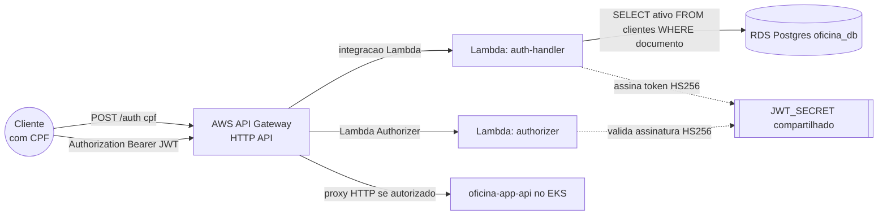

# oficina-auth-gateway

Gateway de autenticação por CPF para o ecossistema Oficina. Expõe um **AWS API Gateway** que:

- recebe o CPF do cliente, valida contra a base de clientes e devolve um **JWT**;
- protege outras rotas exigindo esse JWT, através de um **Lambda Authorizer**, antes de encaminhar a requisição para a [`oficina-app-api`](https://github.com/GrupoPosTech-FIAP/oficina-app-api) rodando no EKS.

Não é necessária nenhuma alteração na `oficina-app-api` — toda a validação acontece na borda (API Gateway).

## Arquitetura



- **`auth-handler`**: valida o formato do CPF, consulta a tabela `clientes` (mesmo RDS Postgres usado pela `oficina-app-api`) e, se o cliente existir e estiver ativo, assina um JWT.
- **`authorizer`**: Lambda Authorizer (REQUEST, simple response) que valida a assinatura/expiração do JWT recebido em `Authorization: Bearer <token>` antes de liberar o proxy até a `oficina-app-api`.
- A rede (VPC, sub-redes) e o Security Group do RDS são reaproveitados dos repositórios [`oficina-infra-cluster`](https://github.com/GrupoPosTech-FIAP/oficina-infra-cluster) e [`oficina-infra-database`](https://github.com/GrupoPosTech-FIAP/oficina-infra-database) via Terraform remote state — nada de infraestrutura duplicada.

## Tecnologias

- **Node.js 20 + TypeScript** — código das duas funções Lambda.
- **AWS Lambda** — `auth-handler` (na VPC, acessa o RDS) e `authorizer` (fora da VPC).
- **AWS API Gateway (HTTP API)** — roteamento público + Lambda Authorizer.
- **Terraform** — toda a infraestrutura acima, usando a role `LabRole` do AWS Academy Learner Lab e remote state em S3 compartilhado com os demais repositórios do grupo.
- **Jest** — testes unitários (CPF, JWT, handlers), rodando sem dependência de AWS ou banco real.

## Contrato da API

### `POST /auth` (pública)

```json
// Request
{ "cpf": "529.982.247-25" }
```

| Situação | Status | Corpo |
|---|---|---|
| CPF mal formado | `400` | `{ "message": "CPF inválido" }` |
| CPF não cadastrado | `404` | `{ "message": "Cliente não encontrado" }` |
| Cliente inativo | `403` | `{ "message": "Cliente inativo" }` |
| Cliente ativo | `200` | `{ "token": "<jwt>" }` |

### Rotas protegidas — `ANY /app/{proxy+}`

Repassa a requisição para a `oficina-app-api`, exigindo `Authorization: Bearer <token>` válido (emitido por `POST /auth`). Token ausente/inválido/expirado → `401`, sem chegar na aplicação.

Uma coleção Bruno com exemplos de request para as duas rotas fica em [`test/bruno/`](test/bruno), no mesmo formato usado pela `oficina-app-api`.

## Rodando localmente

```bash
npm install
npm run lint
npm run build
npm test              # unitário: cpf.ts, jwt.ts, auth-handler, authorizer (tudo mockado, sem AWS/banco)
```

## Deploy

O deploy é manual (workflow `Actions → CD - Deploy do Auth Gateway (AWS) → Run workflow`), pelo mesmo motivo dos outros repositórios do grupo: as credenciais do AWS Academy Learner Lab expiram a cada ~4h e alguns endereços (RDS, LoadBalancer da app-api) mudam a cada recriação. É preciso informar:

- `TF_BUCKET_NAME` — bucket S3 do remote state (o mesmo usado por `oficina-infra-database`).
- `rds_endpoint` — `terraform output -raw DB_Endpoint` rodado em `oficina-infra-database`.
- `app_api_base_url` — `kubectl get svc oficina-api -o jsonpath='{.status.loadBalancer.ingress[0].hostname}'`.

Segredos compartilhados usados pelo workflow (GitHub Secrets do grupo): `AWS_ACCESS_KEY_ID`, `AWS_SECRET_ACCESS_KEY`, `AWS_SESSION_TOKEN`, `JWT_SECRET`, `RDS_PASSWORD`.

**Dependência externa:** o Security Group do RDS (em `oficina-infra-database`) precisa liberar ingress na porta 5432 vindo do Security Group da Lambda `auth-handler` (exportado aqui como output `Lambda_Security_Group_Id`). Sem isso, o `auth-handler` sobe mas não consegue consultar o banco.

## Deploy ativo

_(preencher após o primeiro `terraform apply`, com a URL retornada em `API_Gateway_URL`)_

```
https://<preencher>.execute-api.us-east-1.amazonaws.com
```
